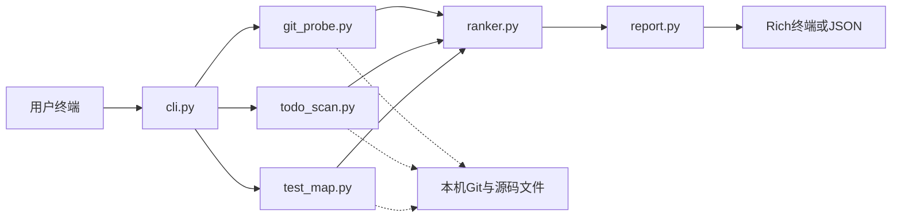

# 代码考古雷达

## 项目功能

**在终端扫描本地 Git 项目，输出「危险地图」：陈旧文件、热改文件、TODO 代码、缺测热（常改却缺测）文件。**

- *缺测判断是命名启发式（如 `foo.py` ↔ `tests/test_foo.py`，`foo.ts` ↔ `foo.test.ts`），而非覆盖率*

只依赖本机 **Git + 文件系统**，不接远程 API。

## 使用方法

### 安装依赖

```bash
cd .../code-radar
python -m pip install -r requirements.txt		# 当前仅包含：`rich`
```

### 运行

*必须在**项目根目录**执行，以便 Python 能找到里面的 `radar` 包*

```bash
cd .../code-radar
python -m radar .              	# 扫描当前项目（若本身是 Git 项目）
python -m radar /path						# 扫描指定项目
python -m radar . --top 10
python -m radar . --since 90 --json
```

| 运行参数         | 含义               | 默认 |
| ---------------- | ------------------ | ---- |
| `path`           | 项目路径           | `.`  |
| `--top N`        | 危险地图条数       | `15` |
| `--since N`      | 热改统计窗口（天） | `90` |
| `--json`         | JSON 输出          | 关闭 |
| `--detail-top N` | 分榜条数（Rich）   | `5`  |

*非 Git 目录会报错并以退出码 `2` 结束。*

## 测试

```bash
cd .../code-radar
python -m unittest discover -s tests -v
```

## 终端输出

自上而下为「危险地图」总览，以及四个分区。只分析 Git 的常见源码；会跳过如 `node_modules`、`plugin`、`*.bundle.js`、`target` 等第三方/构建噪音。

| 分区           | 内容                     | 统计规则（简述）                                             |
| -------------- | ------------------------ | ------------------------------------------------------------ |
| **危险地图**   | 按风险分排序的总览 Top N | `score = 陈旧 + 热改 + TODO + 缺测`；信号形如 `陈旧 120天 · 热改 3次 · TODO 2`，有缺测则追加 `· 缺测`；强度条按本榜最高分相对满格 |
| **陈旧**       | 最久未改文件             | 按距最后一次提交的天数降序取 Top                             |
| **热改**       | 近期常被改动的文件       | 统计 `--since` 窗口内（默认 90 天）出现在提交中的次数；只展示次数 > 0；全为 0 时显示「近 N 天无源码改动」；未提交的本地修改不计 |
| **TODO**       | 注释里的待办/坑          | 匹配 `TODO` / `FIXME` / `HACK` / `XXX`；优先展示含「临时」「workaround」等更离谱的条目 |
| **缺测热文件** | 常改却找不到测试的文件   | 窗口内够热，且按命名约定找不到对应测试时入榜；例如 `foo.py` ↔ `tests/test_foo.py`，`foo.ts` ↔ `foo.test.ts`（非覆盖率） |

## 源码目录

```text
code-radar/
├── requirements.txt          # 第三方依赖清单
├── README.md                 # 本说明
├── radar/                    # 可执行包（python -m radar）
│   ├── __init__.py           # 包信息
│   ├── __main__.py           # -m 启动入口
│   ├── cli.py                # 参数解析与流水线编排
│   ├── git_probe.py          # Git 历史探针（陈旧 / 热改）
│   ├── todo_scan.py          # TODO/FIXME 等注释扫描
│   ├── test_map.py           # 测试文件命名启发式
│   ├── ranker.py             # 风险打分与榜单汇总
│   └── report.py             # Rich / JSON 展示
└── tests/
    ├── test_ranker.py
    ├── test_todo_scan.py
    └── test_test_map.py
```

## 流转架构

**模块职责与一次扫描的数据流：**



**流转简述：**

1. `cli.py` 解析参数，确认目标路径是 Git 项目。
2. `git_probe.py` 批量拉取 tracked 源码的陈旧度、热改次数。
3. `todo_scan.py` / `test_map.py` 分别扫描注释债务与缺测启发式。
4. `ranker.py` 合成风险分并生成各榜单。
5. `report.py` 输出 Rich 表格或 JSON（默认不写磁盘文件）。

