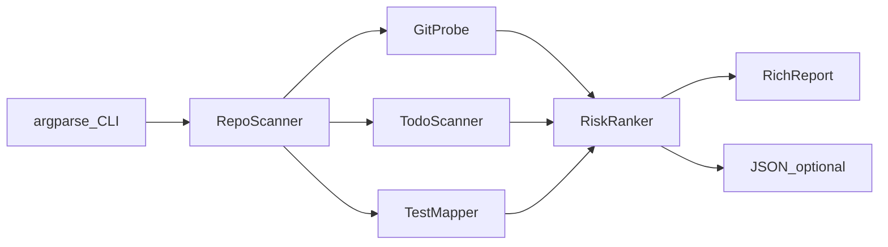

# 代码考古雷达（终端 CLI）方案

## 定位

本地 CLI 工具：用户指定仓库路径 → 本机 Python 进程执行扫描 → 终端打印「危险地图」。不依赖 GitHub API / Sonar 等外部服务，只依赖本机 **Git + 文件系统**。

## 约束（用户补充）

1. **只把第三方类库装进本机 Python；项目本身不安装**
  - 依赖安装：`python -m pip install -r requirements.txt`（当前即 `rich`）
  - **不对**本项目执行 `pip install` / `pip install -e .`，不注册 `code-radar` 全局命令
  - **不创建** `.venv`，README 也不引导 venv
  - 运行：在项目根目录用模块方式启动（源码留在磁盘，由 Python 直接加载本地包）
  - 卸依赖：`python -m pip uninstall rich`（及若不再需要的传递依赖）
2. **代码需有足够详细的中文注释**
  - 每个模块文件顶部：简要说明职责
  - 公开函数/类：说明用途、关键参数、返回值
  - 非显而易见的逻辑（Git 批量解析、风险分权重、测试文件启发式、忽略规则）：写清「为什么」
  - 注释用中文；不要求给每一行废话注释

## 技术选型

- **语言**：Python 3.9+（系统已有 3.9.6）
- **项目路径**：`~/Documents/ai/cursor/code-radar`
- **依赖清单**：`requirements.txt` 仅列出第三方库（`rich`）；其余用标准库
- **运行方式**：
  ```bash
  # 一次性：只装类库到当前 python（不安装本项目）
  cd ~/Documents/ai/cursor/code-radar
  python -m pip install -r requirements.txt

  # 日常：必须在项目根目录执行，以便找到本地 radar 包
  python -m radar /path/to/repo
  python -m radar .
  ```

## 架构




| 模块                        | 职责                                |
| ------------------------- | --------------------------------- |
| `radar/cli.py`       | 参数：`path`、`--top N`、`--json`、忽略规则 |
| `radar/git_probe.py` | 调 `git`：文件列表、最后修改时间、commit 次数     |
| `radar/todo_scan.py` | 扫 `TODO/FIXME/HACK/XXX`，带行号与摘录    |
| `radar/test_map.py`  | 启发式：源文件是否有对应测试文件                  |
| `radar/ranker.py`    | 把「陈旧 / 热改 / TODO / 无测试」合成风险分      |
| `radar/report.py`    | Rich 输出四块榜单 + 总览                  |


## 四类信号（MVP）

1. **陈旧文件**：tracked 文件按最后提交时间排序，最久未改的 Top N
2. **热改文件**：统计近期（默认 90 天）每个文件的 commit 次数，最高 Top N
3. **离谱 TODO**：匹配 `TODO|FIXME|HACK|XXX`，优先展示带「临时」「删掉」等关键词，或同文件多条
4. **常改却缺测**：热改文件中，若不存在约定测试文件则标记
  - 约定示例：`foo.py` → `test_foo.py` / `tests/test_foo.py`；`foo.ts` → `foo.test.ts` / `foo.spec.ts`

风险分（简单可解释）：

```text
score = stale_weight + churn_weight + todo_weight + missing_test_weight
```

终端主视图按 score 排出「危险地图」Top 15，下方再分栏展示四类明细。

## Git 调用策略（性能）

- 先确认目录是 Git 仓库（`git rev-parse --is-inside-work-tree`）
- 用 `git ls-files` 拿 tracked 文件，排除 `node_modules`、`vendor`、锁文件、图片等常见噪音
- **批量**拿历史，避免对每个文件单独起进程：
  - 热改：`git log --since=90.days --name-only --pretty=format:` 一次聚合计数
  - 陈旧：流式/批量解析 last commit 时间，避免 N 次 `git log -1`
- 大仓库默认只分析常见源码后缀：`.py .js .ts .tsx .jsx .go .rs .java .rb .swift` 等

## 终端输出示意

```text
考古雷达  ./my-repo          files=842  window=90d

危险地图 (Top 10)
 82  src/legacy/billing.py     stale 820d  churn 41  TODO 6  no-test
 71  src/api/webhooks.ts       stale 12d   churn 38  TODO 2  no-test
 ...

陈旧 Top5 | 热改 Top5 | TODO 精选 | 缺测热文件
```

支持 `--json` 便于以后接网页或二次处理。

## 目录结构

```text
code-radar/
  requirements.txt        # 仅第三方依赖，如 rich（不包含本项目自安装配置）
  README.md               # 中文：只装依赖、源码运行、卸依赖；不提 venv / 不提 pip install 本项目
  radar/
    __init__.py
    __main__.py
    cli.py
    git_probe.py
    todo_scan.py
    test_map.py
    ranker.py
    report.py
  tests/
    test_ranker.py
    test_todo_scan.py
    test_test_map.py
```

不提供 `pyproject.toml` 的 `[project.scripts]` / 可编辑安装；无需把本包装进 `site-packages`。

## 验收标准

- 仅 `pip install -r requirements.txt` 后，在项目根目录执行 `python -m radar .` 可出报告
- 本机 Python 的 `site-packages` 中**不应**因本项目而出现已安装的 `code-radar` 包或 `code-radar` 命令（除非用户自行另装）
- 在任意本地 Git 仓库能在几秒到几十秒内出报告（中小型仓库）
- 非 Git 目录给出清晰错误退出码
- 四类信号均有输出；`--json` 结构稳定
- 单元测试覆盖：TODO 正则、测试文件匹配、风险分排序
- 业务源码（`radar/` 下）具备足够详细的中文注释

## 明确不做（MVP 之外）

- 不接远程 API、不做覆盖率解析、不做 AST/死代码分析
- 不做 TUI 交互编辑、不写回仓库
- 不引入虚拟环境；不把本项目 pip 安装进 Python；不注册全局短命令

## 实现顺序

1. 搭项目骨架、`requirements.txt`、`python -m radar` 入口
2. 实现 Git 探针（陈旧 + 热改）
3. 实现 TODO 扫描与缺测启发式
4. 风险排序 + Rich 报告
5. 补小测试与 README（只装依赖 / 源码运行 / 卸依赖 + 中文注释落实）

