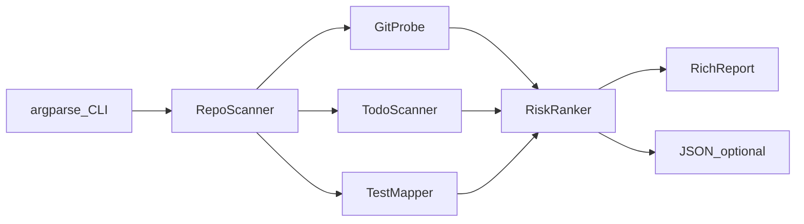

# 代码考古雷达（终端 CLI）方案

## 定位

本地 CLI 工具：用户指定仓库路径 → 本机 Python 进程执行扫描 → 终端打印「危险地图」。不依赖 GitHub API / Sonar 等外部服务，只依赖本机 **Git + 文件系统**。

## 约束（用户补充）

1. **只把第三方类库装进本机 Python；项目本身不安装**
  - 依赖安装：`python -m pip install -r requirements.txt`（当前即 `rich`）
  - **不对**本项目执行 `pip install` / `pip install -e .`，不注册 `code-radar` 全局命令
  - **不创建** `.venv`，README 也不引导 venv
  - 运行：在项目根目录用模块方式启动（源码留在磁盘，由 Python 直接加载本地包）
  - 卸依赖：`python -m pip uninstall rich`（及若不再需要的传递依赖）
2. **代码需有足够详细的中文注释**
  - 每个模块文件顶部：简要说明职责
  - 公开函数/类：说明用途、关键参数、返回值
  - 非显而易见的逻辑（Git 批量解析、风险分权重、测试文件启发式、忽略规则）：写清「为什么」
  - 注释用中文；不要求给每一行废话注释

## 技术选型

- **语言**：Python 3.9+（系统已有 3.9.6）
- **项目路径**：`~/Documents/ai/cursor/code-radar`
- **依赖清单**：`requirements.txt` 仅列出第三方库（`rich`）；其余用标准库
- **运行方式**：
  ```bash
  # 一次性：只装类库到当前 python（不安装本项目）
  cd ~/Documents/ai/cursor/code-radar
  python -m pip install -r requirements.txt

  # 日常：必须在项目根目录执行，以便找到本地 radar 包
  python -m radar /path/to/repo
  python -m radar .
  ```

## 架构




| 模块                        | 职责                                |
| ------------------------- | --------------------------------- |
| `radar/cli.py`       | 参数：`path`、`--top N`、`--since N`、`--json`、`--detail-top N` |
| `radar/git_probe.py` | 调 `git`：文件列表、最后修改时间、窗口内 commit 次数     |
| `radar/todo_scan.py` | 扫 `TODO/FIXME/HACK/XXX`，带行号与摘录    |
| `radar/test_map.py`  | 启发式：源文件是否有对应测试文件                  |
| `radar/ranker.py`    | 把「陈旧 / 热改 / TODO / 无测试」合成风险分；派生各榜单（热改只保留 churn>0） |
| `radar/report.py`    | Rich「雷达面板」式输出 + JSON；完整换行、行间留白、空榜说明；危险地图强度条按本榜最高分相对缩放 |


## 四类信号（MVP）

1. **陈旧文件**：tracked 文件按最后提交时间排序，最久未改的 Top N
2. **热改文件**：统计近期（默认 90 天，可由 `--since` 调整）每个文件出现在提交 diff 中的次数
   - **只统计窗口内真实发生过的改动**（`churn > 0`）；零值不进「热改 Top」
   - 窗口内全部为 0 时，报告显示「近 N 天无源码改动」，**不自动扩大窗口**（不同仓库结果需可比；用户自行 `--since`）
   - 列名用「提交次数」，避免与笼统的「次数」混淆
   - 未提交的本地修改不计入热改
3. **离谱 TODO**：匹配 `TODO|FIXME|HACK|XXX`，优先展示带「临时」「删掉」等关键词，或同文件多条
4. **常改却缺测**：热改文件中，若不存在约定测试文件则标记
  - 约定示例：`foo.py` → `test_foo.py` / `tests/test_foo.py`；`foo.ts` → `foo.test.ts` / `foo.spec.ts`

风险分（简单可解释）：

```text
score = stale_weight + churn_weight + todo_weight + missing_test_weight
```

终端主视图按 score 排出「危险地图」Top N，下方再纵向展示四类明细（陈旧 / 热改 / TODO / 缺测）。

## Git 调用策略（性能）

- 先确认目录是 Git 仓库（`git rev-parse --is-inside-work-tree`）
- 用 `git ls-files` 拿 tracked 文件，排除 `node_modules`、`vendor`、锁文件、图片等常见噪音
- **批量**拿历史，避免对每个文件单独起进程：
  - 热改：`git log --since=N.days --name-only --pretty=format:` 一次聚合计数（N 默认 90，对应 `--since`）
  - 陈旧：流式/批量解析 last commit 时间，避免 N 次 `git log -1`
- 大仓库默认只分析常见源码后缀：`.py .js .ts .tsx .jsx .go .rs .java .rb .swift` 等
- 热改语义：窗口内文件出现在 diff 的次数；未提交改动不计；零值不进榜单

## 终端输出规则（Rich）

展示以可读性优先，规则如下：

1. **顶部品牌条**：块字横幅 + 仓库路径 + `files / window / top` 元信息
2. **分区标题**：粗边框面板内高对比标题条（危险地图、陈旧、热改、TODO、缺测）
3. **不截断**：路径与 TODO 摘录完整展示，窄终端用换行（`overflow=fold`），禁止省略号截断
4. **行间距**：表格 `leading=1` 行间留白，降低长路径串行误读；不用密集分割线
5. **路径样式**：目录弱色、文件名加粗，便于扫读
6. **危险地图**：分数 + 强度条 + 路径/信号两行布局
   - 强度条用于同一次扫描内扫读相对高低，**以本榜（当前危险地图 Top）最高分为满格**缩放
   - 不用固定饱和阈值（旧版按 40 满格会导致高分区全部顶满、失去区分度）
   - 分数相同则条长相同；`score=0` 为空条
7. **热改空态**：无 `churn>0` 时显示「近 N 天无源码改动」（N 取当前 `--since`）

示意（结构，非精确排版）：

```text
╔══════════════════════════════════════╗
║           RADAR 块字横幅             ║
║         ◈  考 古 雷 达               ║
║   /path/to/repo · 842 files · 90d    ║
╚══════════════════════════════════════╝

◆ 危险地图 · TOP 10
  1   82 ██████   src/legacy/billing.py      ← 本榜最高分，满格
                 stale 820d  churn 41  TODO 6  no-test
  2   41 ███░░░   src/api/webhooks.ts        ← 约为最高分一半
                 stale 12d   churn 38  TODO 2  no-test

◆ 陈旧 / ◆ 热改（提交次数）/ ◆ TODO / ◆ 缺测热文件
  （热改若全零 → 「近 90 天无源码改动」）
```

支持 `--json` 便于以后接网页或二次处理；JSON 中 `churn_top` 同样只含窗口内有改动的文件。

## 目录结构

```text
code-radar/
  requirements.txt        # 仅第三方依赖，如 rich（不包含本项目自安装配置）
  README.md               # 中文：只装依赖、源码运行、卸依赖；不提 venv / 不提 pip install 本项目
  radar/
    __init__.py
    __main__.py
    cli.py
    git_probe.py
    todo_scan.py
    test_map.py
    ranker.py
    report.py
  tests/
    test_ranker.py
    test_todo_scan.py
    test_test_map.py
    test_report.py        # Rich 换行不截断、热改空态、强度条相对缩放等
```

不提供 `pyproject.toml` 的 `[project.scripts]` / 可编辑安装；无需把本包装进 `site-packages`。

## 验收标准

- 仅 `pip install -r requirements.txt` 后，在项目根目录执行 `python -m radar .` 可出报告
- 本机 Python 的 `site-packages` 中**不应**因本项目而出现已安装的 `code-radar` 包或 `code-radar` 命令（除非用户自行另装）
- 在任意本地 Git 仓库能在几秒到几十秒内出报告（中小型仓库）
- 非 Git 目录给出清晰错误退出码
- 四类信号均有输出；`--json` 结构稳定
- **热改**：零 churn 不进榜；窗口全零时 Rich/数据侧表现为空榜 + 明确空态说明；`--since` 可扩大窗口后出现记录
- Rich 输出：长路径/摘录完整换行、无省略截断；危险地图强度条按本榜最高分相对缩放
- 单元测试覆盖：TODO 正则、测试文件匹配、风险分排序、热改零值过滤、报告换行/空态、强度条相对缩放
- 业务源码（`radar/` 下）具备足够详细的中文注释
## 明确不做（MVP 之外）

- 不接远程 API、不做覆盖率解析、不做 AST/死代码分析
- 不做 TUI 交互编辑、不写回仓库
- 不引入虚拟环境；不把本项目 pip 安装进 Python；不注册全局短命令

## 实现顺序

1. 搭项目骨架、`requirements.txt`、`python -m radar` 入口
2. 实现 Git 探针（陈旧 + 热改）
3. 实现 TODO 扫描与缺测启发式
4. 风险排序 + Rich 报告
5. 补小测试与 README（只装依赖 / 源码运行 / 卸依赖 + 中文注释落实）

